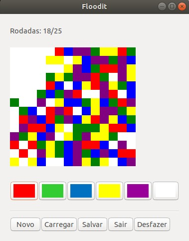

# Flood-It

<p ></p>

## Functionalities

- [X] Creation of typedef, structs and enuns.
- [X] Modularization of the program (.c and .h files).
- [X] Random generation of the tray (14x14 cells);
- [X] Presentation of the initial interface of the game with the generated board.
- [X] Read user input.
- [X] Recursively updating the tray.
- [X] Filling the adjacent ones of the same color.
- [X] Implementation of the end condition of the game (maximum 25 rounds or board completely filled).
- [X] Saving and loading the state of a game.
- [X] Uniform distribution in the generation of colors in the tray.
- [X] Graphical Interface Development compatible with Linux and Windows.
- [X] Communication with the user by clicking the mouse.
- [X] Enable the creation of matches with other levels of difficulty with bigger / smaller boards and maximum number of moves.
- [X] Documentation of functionalities of each subroutine.

- [ ] Give the possibility to Save and Load several games.
- [ ] Enable the creation of games with different colors.

## Compiling

### Windows

* Graphic Library: GTK
* Version: 3.6.4
* Download: http://www.gtk.org/download/win32.php
* Installation: http://www.gtk.org/download/win32_tutorial.php

```bash
# Compiling loadGame
gcc loadGame.c interface.c color.c table.c file.c controle.c -o loadGame -mms-bitfields 
-IC:/gtk3/include/gtk-3.0 -IC:/gtk3/include/cairo -IC:/gtk3/include/pango-1.0 -IC:/gtk3/include/atk-1.0 
-IC:/gtk3/include/cairo -IC:/gtk3/include -IC:/gtk3/include/gdk-pixbuf-2.0 -IC:/gtk3/include/libpng15 
-IC:/gtk3/include/glib-2.0 -IC:/gtk3/lib/glib-2.0/include -LC:/gtk3/lib -lgtk-3 -lgobject-2.0 -lglib-2.0
# Compiling newGame
gcc newGame.c color.c table.c file.c -o newGame
```

### Linux

* Graphic Library: GTK
* Version: 3.12
* Download: http://www.gtk.org/download/linux.php or : 

```bash
sudo apt install libgtk-3-dev
```

* Installation: https://developer.gnome.org/gtk3/stable/gtk-building.html

```bash
# Compiling loadGame
gcc loadGame.c interface.c color.c table.c file.c controle.c -o loadGame `pkg-config --cflags --libs gtk+-3.0`
# Compiling newGame
gcc newGame.c color.c table.c file.c -o newGame
```

##  Members

Felipe Barbalho Rocha 
Raul Silveira Silva

